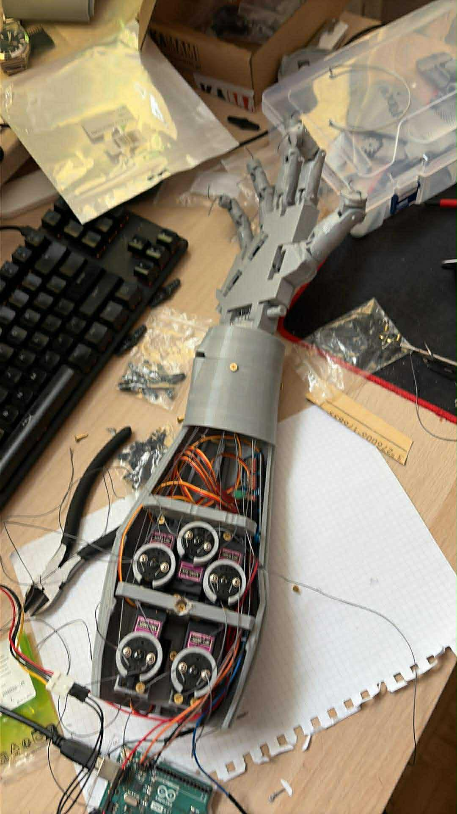
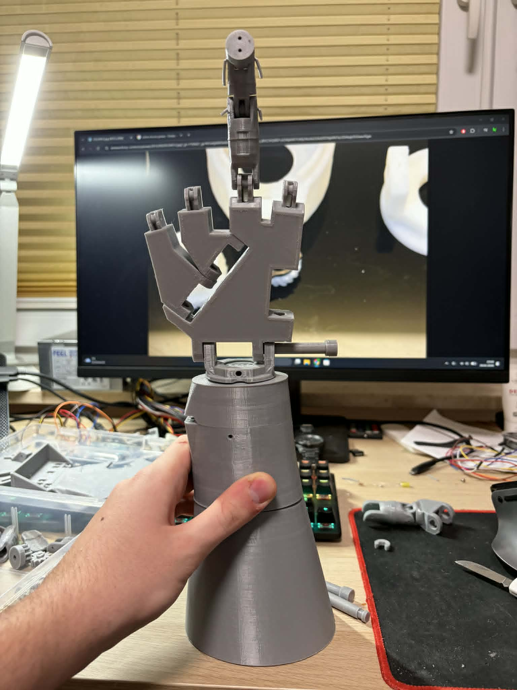
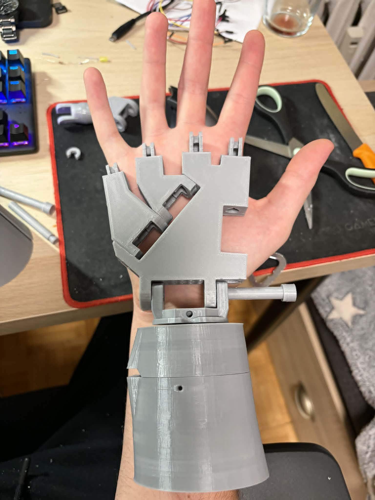
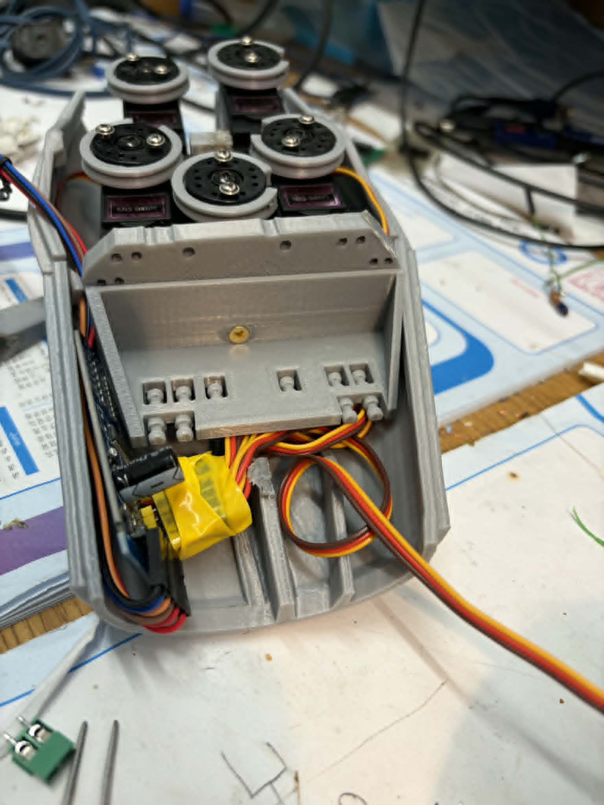
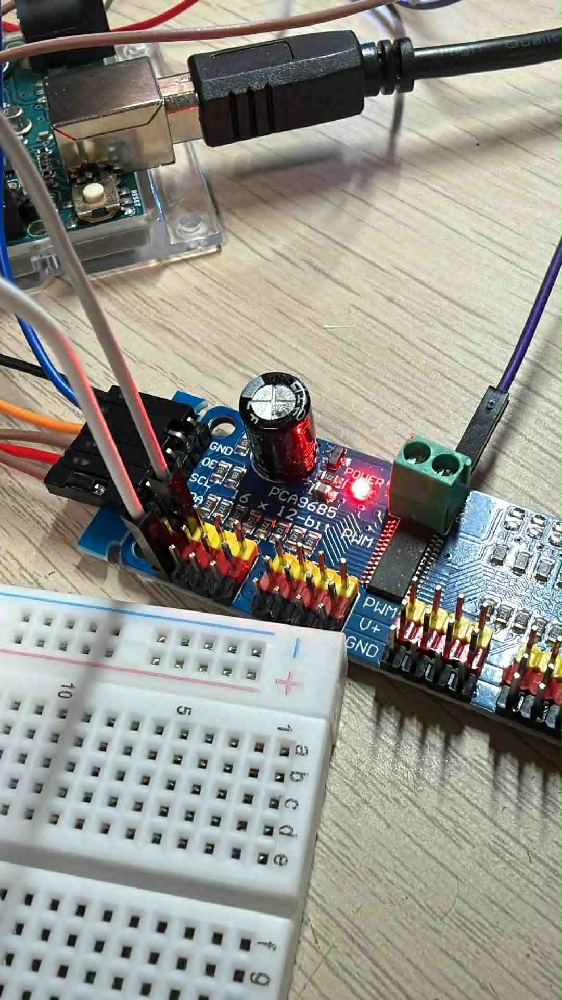
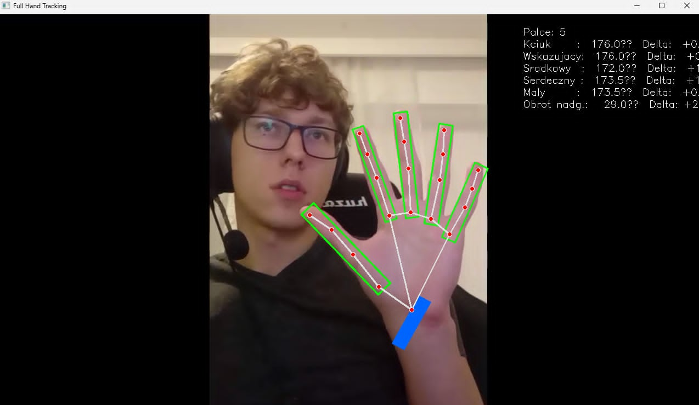
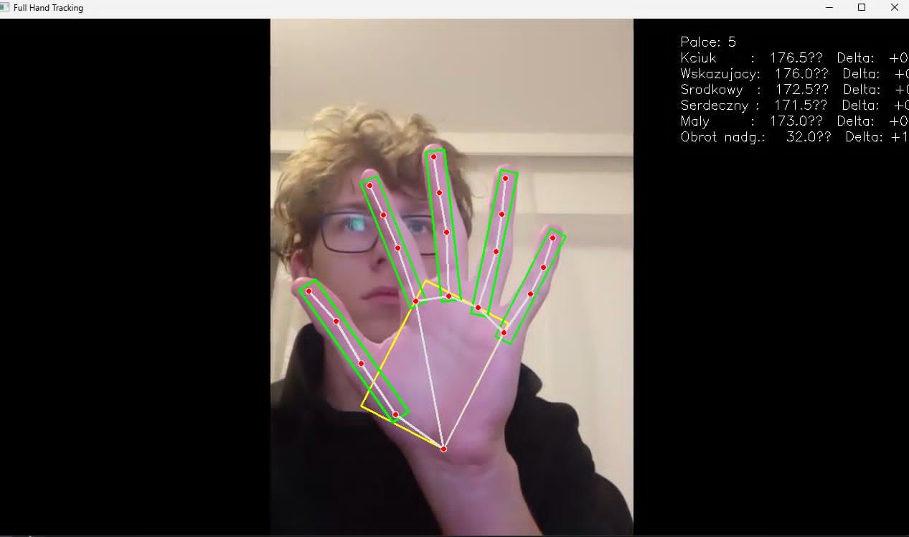

# Robotic Hand Tracking Controller

[](https://github.com/MatysiakQ/Hand-Tracking-Control-System)
[](https://www.python.org/)
[](https://opencv.org/)
[](https://developers.google.com/mediapipe)
[](https://www.ni.com/labview/)
[](https://www.raspberrypi.com/)

A computer vision project that tracks human hand movement and controls a physical robotic hand using servo motors, MediaPipe hand tracking, LabVIEW integration, and a custom Raspberry Pi middleware layer.

---

## Overview

This project combines computer vision, robotics, and embedded systems to control a physical robotic hand.

A webcam feed is processed using OpenCV and MediaPipe to detect hand landmarks in real time. Finger bending angles are calculated, filtered, and mapped to PWM values used to control servo motors through a PCA9685 controller.

The project also includes a custom middleware layer that enables LabVIEW-based control on Raspberry Pi devices, allowing LabVIEW components and Python-based vision processing to work together.

The repository contains Python control software, LabVIEW project files, STL models used to build the robotic hand and forearm assembly, project photos, and demonstration videos.

---

## Features

* Real-time hand tracking
* Hand landmark detection
* Finger angle calculation
* Rotation-aware landmark processing
* Servo PWM mapping
* PCA9685 servo control
* Motion smoothing using EMA filtering
* Deadband filtering
* Idle and Tracking operating modes
* Automatic return-to-default position
* Calibration wave sequence
* LabVIEW integration
* Raspberry Pi middleware support
* Hardware fallback mode
* Included STL models for the hand and forearm
* Included LabVIEW assets

---

## Tech Stack

| Category               | Technology       |
| ---------------------- | ---------------- |
| Language               | Python           |
| Computer Vision        | OpenCV           |
| Hand Tracking          | MediaPipe        |
| Numerical Computing    | NumPy            |
| Servo Control          | Adafruit PCA9685 |
| Hardware Communication | board, busio     |
| Engineering Tools      | LabVIEW          |
| Embedded Platform      | Raspberry Pi     |
| CAD Assets             | STL Models       |

---

## Architecture

```text
Camera
   ↓
OpenCV
   ↓
MediaPipe
   ↓
Hand Landmark Detection
   ↓
Finger Angle Calculation
   ↓
Signal Smoothing
   ↓
PWM Mapping
   ↓
Python Control Layer
   ↓
LabVIEW Middleware
   ↓
Raspberry Pi
   ↓
PCA9685
   ↓
Servo Motors
   ↓
Robotic Hand
```

---

## Application Flow

1. Capture frames from a webcam.
2. Detect a hand using MediaPipe.
3. Extract hand landmarks.
4. Normalize landmarks relative to hand orientation.
5. Calculate finger bending angles.
6. Apply smoothing and deadband filtering.
7. Convert values to PWM ranges.
8. Send commands through the middleware layer.
9. Drive servos through the PCA9685 controller.
10. Replicate finger movement on the robotic hand.

---

## Project Gallery

### Internal Hand Mechanism

The assembled robotic hand showing the internal tendon routing and servo-driven mechanism.



---

### Hardware Development Progress

Latest hardware development stage.



Previous development iterations.







---

### Python Hand Tracking Development

Development and testing of hand tracking and wrist detection.





---

## Demo Videos

### Full Robotic Hand Demonstration

Physical robotic hand controlled through the complete tracking pipeline.

📹 [Hand Tracking Demo](video/Hand_Tracking.mp4)

---

### Python Hand Tracking Demonstration

Real-time hand tracking, landmark detection, and motion analysis.

📹 [Hand Tracking Python Demo](video/Hand_Tracking_py.mp4)

---

## Installation

### Requirements

* Python 3
* Webcam
* PCA9685 controller (optional for hardware control)

### Install Dependencies

```bash
pip install opencv-python mediapipe numpy adafruit-circuitpython-pca9685
```

### Run

```bash
python Kod/script.py
```

---

## Configuration

Configuration values are defined directly inside:

```text
Kod/script.py
```

Examples include:

* finger smoothing factors,
* deadband thresholds,
* activation timings,
* timeout values,
* PWM ranges.

No environment variables are required.

---

## Technical Highlights

### Rotation-Aware Landmark Processing

Hand landmarks are normalized relative to hand orientation before angle calculations.

### Motion Smoothing

Servo commands are smoothed using Exponential Moving Average (EMA).

### Deadband Filtering

Small movements are ignored to reduce servo jitter.

### Per-Finger Calibration

Each finger uses independent PWM ranges.

### State Machine

The application operates using IDLE and TRACKING states.

### LabVIEW Middleware

A custom middleware layer enables communication between LabVIEW components and Raspberry Pi-based control hardware.

### Hardware Fallback Mode

A DummyPCA implementation allows running the application without physical hardware.

---

## Code Highlights

### Hand Landmark Detection

MediaPipe is used to detect and track hand landmarks in real time.

```python
results = hands.process(rgb_frame)

if results.multi_hand_landmarks:
    for hand_landmarks in results.multi_hand_landmarks:
        mp_draw.draw_landmarks(
            frame,
            hand_landmarks,
            mp_hands.HAND_CONNECTIONS
        )
```

---

### Finger Angle Calculation

Finger bending is calculated using geometric relationships between hand landmarks.

```python
def calculate_angle(a, b, c):
    ba = a - b
    bc = c - b

    cosine_angle = np.dot(ba, bc) / (
        np.linalg.norm(ba) * np.linalg.norm(bc)
    )

    return np.degrees(
        np.arccos(
            np.clip(cosine_angle, -1.0, 1.0)
        )
    )
```

---

### Motion Smoothing

Servo movement is smoothed using an Exponential Moving Average (EMA) filter.

```python
filtered_value = (
    alpha * target_value +
    (1 - alpha) * previous_value
)
```

---

## Project Structure

```text
ADAPTER/
├── Adapter STL models

Kod/
├── Python source code
├── LabVIEW project files (*.vi)
├── Controls (*.ctl)
└── Configuration assets (*.ctt)

photos/
├── Hand_Inside.jpg
├── Work_in_Progres1.jpg
├── Work_in_Progres2.jpg
├── Work_in_Progres3.jpg
├── Work_in_Progres4.jpg
├── Work_in_Progres_py1.jpg
└── Work_in_Progres_py2.jpg

PRZEDRAMIE/
├── Forearm STL models

REKA ROBOTA/
├── Hand STL models

video/
├── Hand_Tracking.mp4
└── Hand_Tracking_py.mp4
```

---

## Testing

No automated tests are included in the repository.

---

## CI/CD

No CI/CD workflows are included in the repository.

---

## Future Improvements

* Complete wrist tracking functionality currently under development
* Move configuration values to external configuration files
* Add diagnostics and logging
* Improve calibration workflow
* Support additional servo configurations

---

## What I Learned

This project helped me learn how computer vision can be combined with hardware control. I worked with MediaPipe hand tracking, geometric calculations, signal filtering, and servo motor control. It was also a good opportunity to connect software with a physical robotic system and work with custom-designed mechanical components.

---

## Source Code Availability

Source code is private due to commercial and intellectual property reasons.
